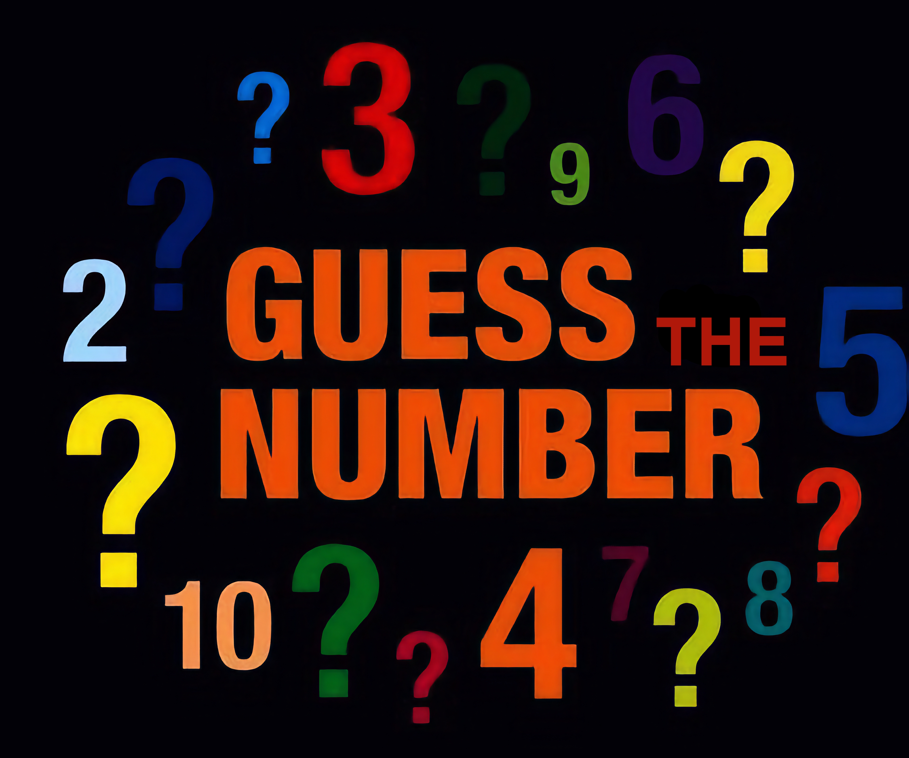

# 🎯 Guess the Number - Console Game

## 💡 Project Title
A C# console-based number guessing game with difficulty levels, retry logic, input validation, and visual feedback through colored messages. Built as a beginner-friendly project to explore logical operations, loops, conditions, and methods.

  

---

## 📌 Project Goals
The goal of this project is to implement a number guessing game in the console, where the computer randomly generates a number and the player has to guess it within a limited number of tries. With each successful guess, the player levels up, and the number range and difficulty increase.

This project allows the practice of core programming skills such as:
- User input and output
- Loops and conditions
- Exception handling
- Method structuring
- Use of `ref` and `List<T>`
- Dynamic difficulty based on player performance

---

## ✅ My Solution
The solution is implemented using native **C#/.NET** without any external libraries. Key aspects:

- **Random number generation:** `System.Random` is used to create the secret number each round.
- **Input validation:** Custom method ensures user input is a valid `ulong`, using `TryParse` and exception throwing.
- **Looping & levels:** A loop tracks tries and levels, increasing difficulty (range of number and available attempts) as the player wins.
- **Scoring system:** Correct guesses are saved in a `List<ulong>`, and displayed at the end or upon exit.
- **Console feedback:** Colored messages (red for errors, green for success, blue/yellow for tips) using `Console.ForegroundColor`.
- **Play Again logic:** The player can continue after loss or victory, with different prompts handled via a shared method.

---

## 📋 Input and Output

### 🎮 Player Input
- The player is asked to guess a number in a specific range depending on the current level (e.g. 1-100 for level 1).
- The input must be a number. Invalid entries are caught and shown in red.

### 🧠 Computer Logic
- The computer randomly generates a number based on the level.
- The game then provides feedback:
  - "Too high!"
  - "Too low!"
  - Or congratulates the player.

### 🏆 Outcome
- On correct guess: Player levels up and is prompted whether they want to continue.
- On loss: Player can try again or exit.

---

## 📊 Game Flow Table

| Action                      | Result/Feedback            |
|----------------------------|----------------------------|
| Guess too low              | "Too Low!" (blue)          |
| Guess too high             | "Too High!" (red)          |
| Guess correct              | "Congratulations!" (green) |
| Input not a number         | Error message (red bg)     |
| Win → level up prompt      | Player chooses [y/n]       |
| Lose → try again prompt    | Player chooses [y/n]       |

---

## 📸 Screenshots

Below are some gameplay examples from the Guess a Number console game:

  
   <em>Example 4: Player successfully finishes two levels, then chooses to quit</em>

  
   <em>Example 5: Player loses, then chooses to play again and continues</em>

  
   <em>Example 6: Player enters invalid input, then runs out of tries</em>

---

## 💻 Link to the Source Code
You can view the source code for this project here:

[Source Code](GuessNumber/GuessNumber/GuessNumber.cs)

---

## 🚀 Live Demo
You can play the game directly in your web browser here:

---

## 🧠 Technologies Used
- C#
- .NET Console
- JetBrains Rider / Replit
- Git & GitHub for version control

---

## ✍ Author
Created by **Krasmir Naydenov** as part of a personal console projects series for beginners.

---

## 📄 License
Licensed under the [MIT License](LICENSE).
